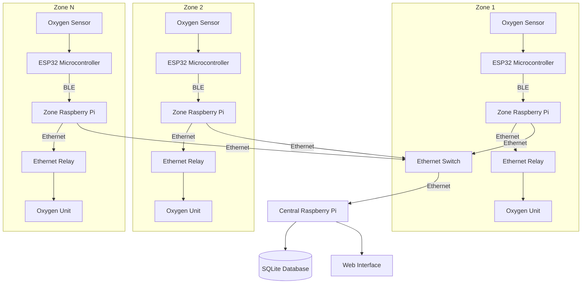
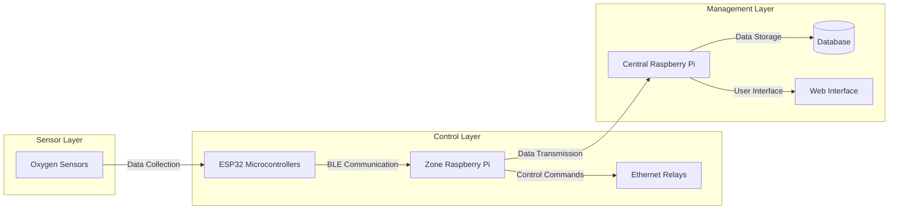
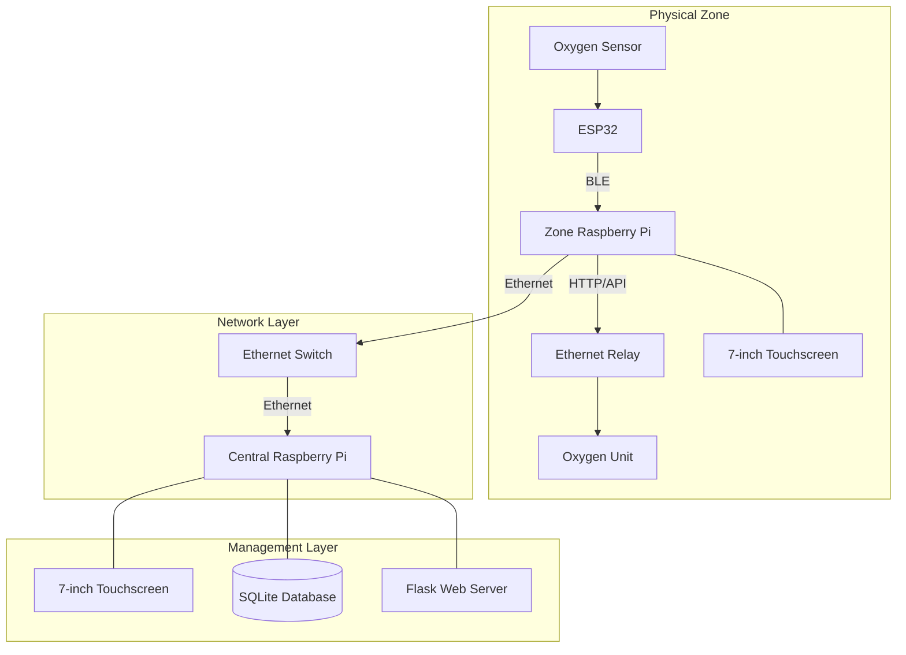
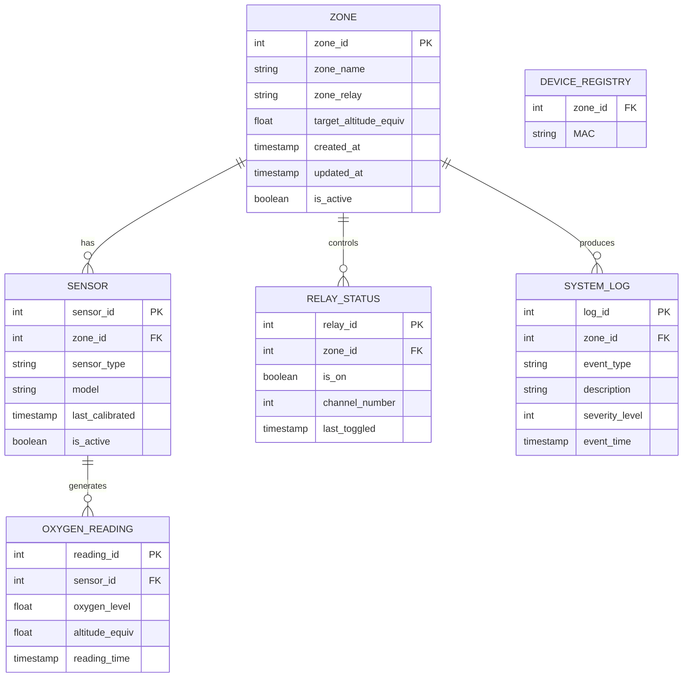
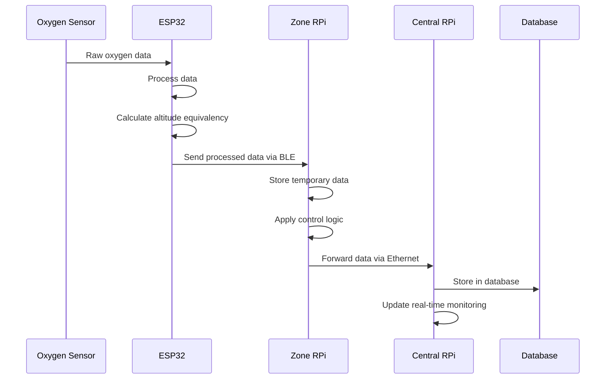
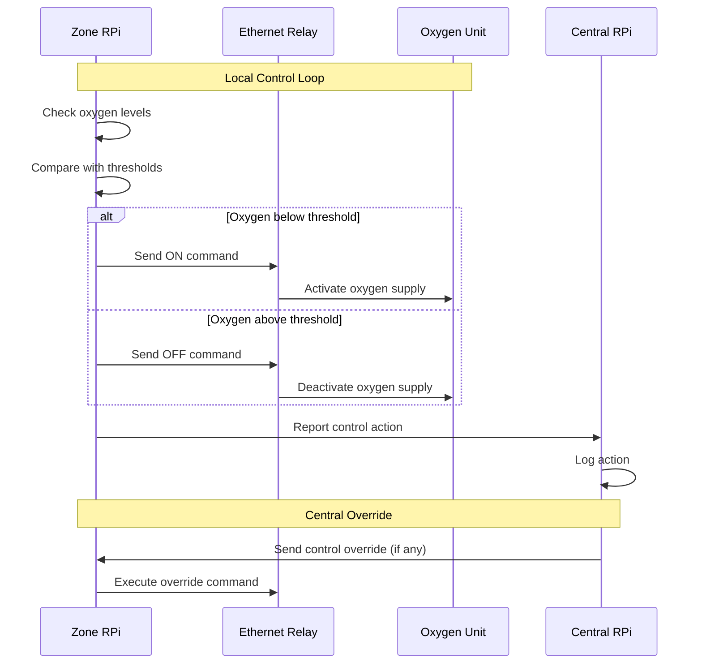
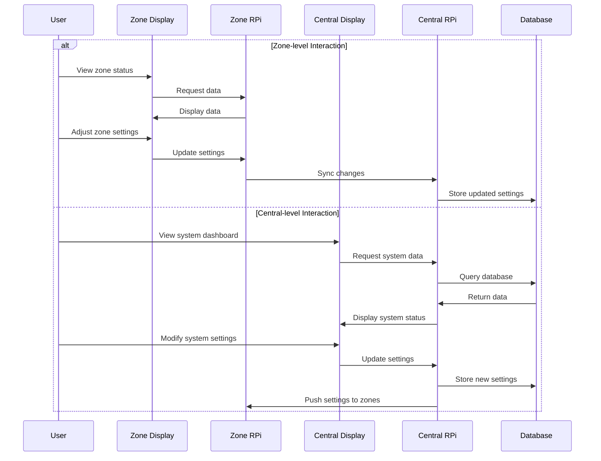

# Oxygen Enrichment Control System Design_v0.1
## Architecture Plan

## Table of Contents
- [Oxygen Enrichment Control System Design\_v0.1](#oxygen-enrichment-control-system-design_v01)
  - [Architecture Plan](#architecture-plan)
  - [Table of Contents](#table-of-contents)
  - [1. System Overview](#1-system-overview)
  - [2. High-Level Design (HLD)](#2-high-level-design-hld)
    - [2.1 System Architecture](#21-system-architecture)
    - [2.2 Component Diagram](#22-component-diagram)
    - [2.3 Deployment Architecture](#23-deployment-architecture)
  - [3. Low-Level Design (LLD)](#3-low-level-design-lld)
    - [3.1 Hardware Components](#31-hardware-components)
    - [3.2 Software Components](#32-software-components)
      - [Microcontroller Firmware (ESP32)](#microcontroller-firmware-esp32)
      - [Zone Raspberry Pi Software](#zone-raspberry-pi-software)
      - [Central Raspberry Pi Software](#central-raspberry-pi-software)
    - [3.3 Database Schema](#33-database-schema)
    - [3.4 API Design](#34-api-design)
      - [Zone RPi API Endpoints](#zone-rpi-api-endpoints)
      - [Central RPi API Endpoints](#central-rpi-api-endpoints)
  - [4. Data Flow Diagrams](#4-data-flow-diagrams)
    - [4.1 Sensor Data Flow](#41-sensor-data-flow)
    - [4.2 Control System Flow](#42-control-system-flow)
    - [4.3 User Interaction Flow](#43-user-interaction-flow)
  - [5. Processing and Management Plan](#5-processing-and-management-plan)
      - [Processing Optimization](#processing-optimization)
      - [Data Management Strategy](#data-management-strategy)
      - [Current Infrastructure](#current-infrastructure)
  - [6. References](#6-references)

## 1. System Overview

The Oxygen Enrichment Control System is designed for vacation guest houses to monitor and manage oxygen levels in different zones. The system uses oxygen sensors connected to ESP32 microcontrollers that communicate via Bluetooth with zone-specific Raspberry Pi units. Each zone has an oxygen supply unit controlled through Web Ethernet relays. The central Raspberry Pi collects data from all zones and provides system-wide monitoring and control.

**Key Features:**
- Real-time oxygen level monitoring
- Automated oxygen enrichment based on predefined thresholds
- Altitude equivalency calculation
- Zone-specific monitoring and control
- Centralized management interface
- Local touchscreen displays in each zone

## 2. High-Level Design (HLD)

### 2.1 System Architecture

### 2.2 Component Diagram

### 2.3 Deployment Architecture

## 3. Low-Level Design (LLD)

### 3.1 Hardware Components

| Component | Specifications | Purpose |
|-----------|---------------|---------|
| STM32 Microcontroller | ARM Cortex-M4, Low-power | Process sensor data |
| ESP32 | Dual-core, Wi-Fi/BLE | Communication bridge |
| Oxygen Sensor | Electrochemical/Zirconia-based | Monitor oxygen levels |
| Raspberry Pi 4 | Quad-core, 4GB+ RAM | Zone control and display |
| 7" Touchscreen | 800x480 resolution | User interface |
| 16-channel Ethernet Relay | 12V/24V SPDT, 8 GPIOs | Control oxygen units |
| Ethernet Switch | Gigabit, managed | Network connectivity |
| Oxygen Unit | Commercial grade | Oxygen enrichment |

### 3.2 Software Components

#### Microcontroller Firmware (ESP32)
- **Language**: C/C++
- **Key Functions**:
  - Sensor data acquisition
  - Data preprocessing
  - BLE communication with Raspberry Pi
  - Low-level error handling

#### Zone Raspberry Pi Software
- **Language**: Python
- **Frameworks**: Flask
- **Key Functions**:
  - BLE data reception
  - Local python script collecting sensor data via. BLE and sending to central via. API request logic
  - Local flask app to get MAC address 
  - UI rendering for touchscreen
  - Communication with central RPi
  - Ethernet relay control
  - ESP32 gpio pin control via. BLE
  - Local logging and monitoring

#### Central Raspberry Pi Software
- **Language**: Python
- **Frameworks**: Flask
- **Key Functions**:
  - Zone configuration
  - System-wide monitoring
  - Database management
  - Web interface hosting
  - Alert and notification system
  - Centralized logging and reporting
  - Relay control logic
  - ESP32 gpio control logic
  - SMTP configuration and email sender

### 3.3 Database Schema

### 3.4 API Design

#### Zone RPi API Endpoints

| Endpoint | Method | Description |
|----------|--------|-------------|
| `/api/sensor/data` | GET | Retrieve latest sensor data |
| `/api/relay/status` | GET | Get current relay status |
| `/api/relay/toggle` | POST | Toggle relay state |
| `/api/settings` | GET/POST | Retrieve/update zone settings |

#### Central RPi API Endpoints

| Endpoint | Method | Description |
|----------|--------|-------------|
| `/api/zones` | GET | List all zones |
| `/api/zones/{id}` | GET | Get specific zone details |
| `/api/zones/{id}/history` | GET | Get historical data for zone |
| `/api/system/status` | GET | Get overall system status |
| `/api/system/logs` | GET | Retrieve system logs |

## 4. Data Flow Diagrams

### 4.1 Sensor Data Flow

### 4.2 Control System Flow

### 4.3 User Interaction Flow

## 5. Processing and Management Plan

#### Processing Optimization

- Implement multi-threading for sensor data processing
- Optimize database queries with proper indexing
- Use in-memory caching for frequently accessed data
- Implement efficient data aggregation algorithms

#### Data Management Strategy

- Implement data retention policies (raw data vs. aggregated data)
- Use time-based partitioning for sensor readings
- Implement data archiving for historical analysis

#### Current Infrastructure

- Wired Ethernet for zone-to-central communication
- BLE for sensor-to-zone communication

## 6. References

1. STM32 Microcontroller Documentation
2. ESP32 Technical Reference Manual
3. Raspberry Pi 4 Datasheet
4. Web Ethernet Relay Technical Specifications
5. Flask Web Framework Documentation
6. PostgreSQL Documentation
7. IoT System Architecture Best Practices
