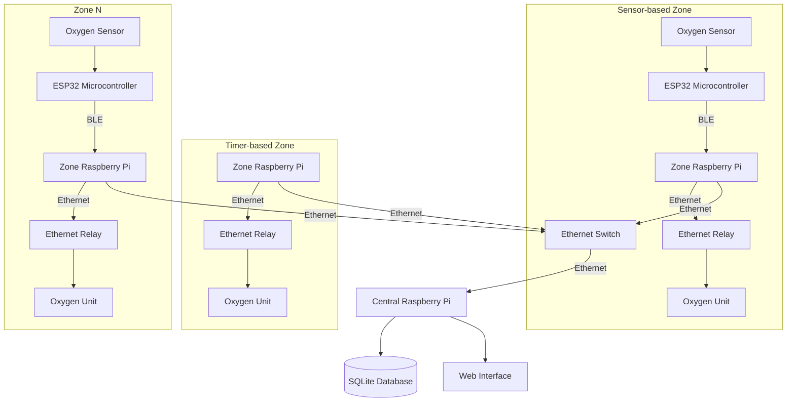
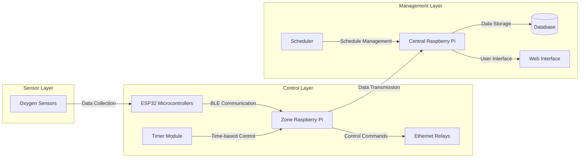
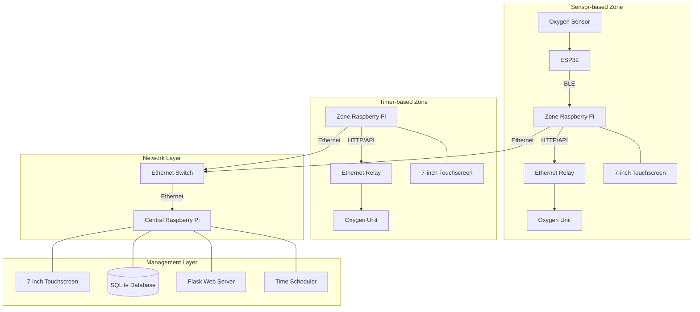
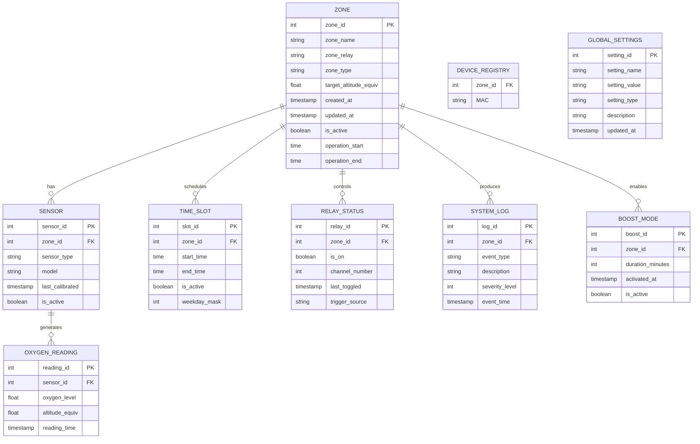
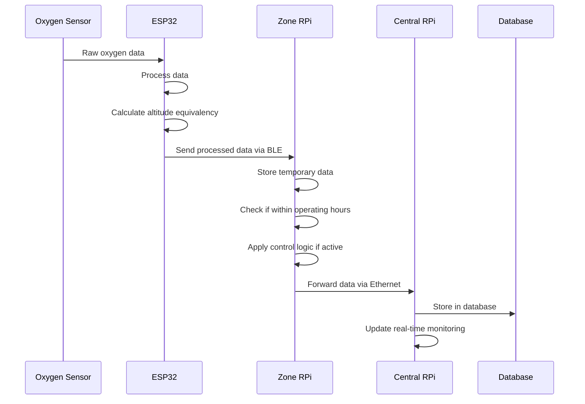
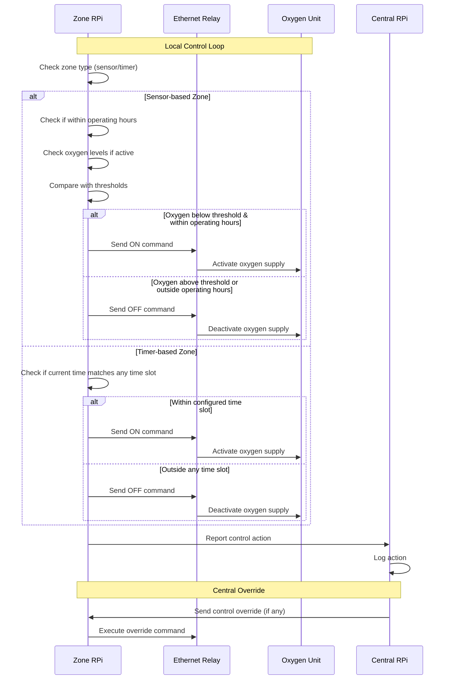
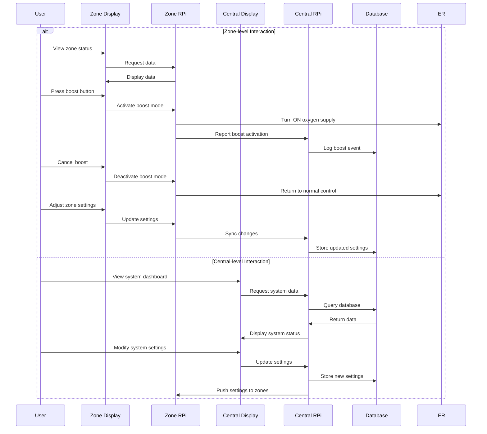
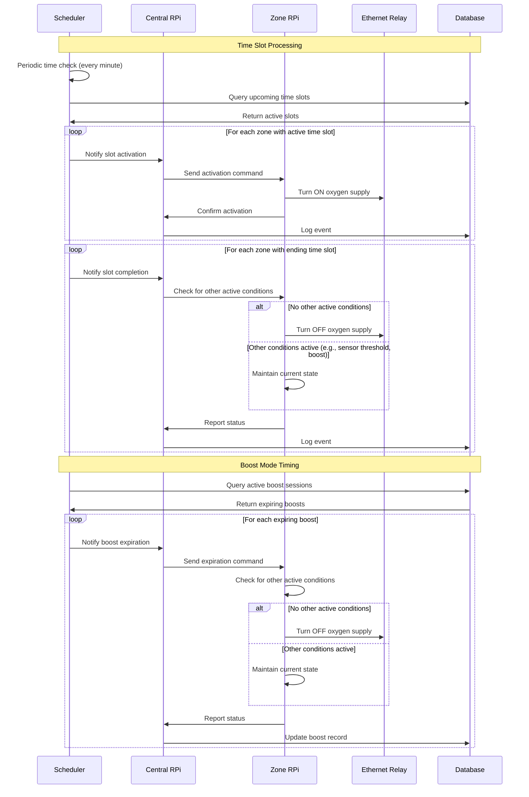

# Oxygen Enrichment Control System Design_v1.0
## Architecture Plan

## Table of Contents
- [Oxygen Enrichment Control System Design\_v1.0](#oxygen-enrichment-control-system-design_v10)
  - [Architecture Plan](#architecture-plan)
  - [Table of Contents](#table-of-contents)
  - [1. System Overview](#1-system-overview)
  - [2. High-Level Design (HLD)](#2-high-level-design-hld)
    - [2.1 System Architecture](#21-system-architecture)
    - [2.2 Component Diagram](#22-component-diagram)
    - [2.3 Deployment Architecture](#23-deployment-architecture)
  - [3. Low-Level Design (LLD)](#3-low-level-design-lld)
    - [3.1 Hardware Components](#31-hardware-components)
    - [3.2 Software Components](#32-software-components)
      - [Microcontroller Firmware (ESP32)](#microcontroller-firmware-esp32)
      - [Zone Raspberry Pi Software](#zone-raspberry-pi-software)
      - [Central Raspberry Pi Software](#central-raspberry-pi-software)
    - [3.3 Database Schema](#33-database-schema)
    - [3.4 API Design](#34-api-design)
      - [Zone RPi API Endpoints](#zone-rpi-api-endpoints)
      - [Central RPi API Endpoints](#central-rpi-api-endpoints)
    - [3.5 Sensor Sampling Framework](#35-sensor-sampling-framework)
      - [Sampling Frequency Configuration](#sampling-frequency-configuration)
      - [Data Processing Pipeline](#data-processing-pipeline)
      - [Data Retention Policies](#data-retention-policies)
    - [3.6 Logging and Monitoring System](#36-logging-and-monitoring-system)
      - [Logging Levels](#logging-levels)
  - [4. Zone Operation Modes](#4-zone-operation-modes)
    - [4.1 Sensor-based Zone Operation](#41-sensor-based-zone-operation)
    - [4.2 Timer-based Zone Operation](#42-timer-based-zone-operation)
    - [4.3 Boost Mode Operation](#43-boost-mode-operation)
  - [5. Data Flow Diagrams](#5-data-flow-diagrams)
    - [5.1 Sensor Data Flow](#51-sensor-data-flow)
    - [5.2 Control System Flow](#52-control-system-flow)
    - [5.3 User Interaction Flow](#53-user-interaction-flow)
    - [5.4 Time-based Control Flow](#54-time-based-control-flow)
  - [6. Processing and Management Plan](#6-processing-and-management-plan)
    - [6.1 Processing Optimization](#61-processing-optimization)
    - [6.2 Data Management Strategy](#62-data-management-strategy)
    - [6.3 Current Infrastructure](#63-current-infrastructure)
  - [7. References](#7-references)

## 1. System Overview

The Oxygen Enrichment Control System is designed for vacation guest houses to monitor and manage oxygen levels in different zones. The system now supports both sensor-based and timer-based oxygen control:

1. **Sensor-based Zones**: Use oxygen sensors connected to ESP32 microcontrollers that communicate via Bluetooth with zone-specific Raspberry Pi units.
2. **Timer-based Zones**: Use predefined time slots to control oxygen supply where sensors cannot be installed.

Each zone has an oxygen supply unit controlled through Web Ethernet relays. The central Raspberry Pi collects data from all zones and provides system-wide monitoring and control.

**Key Features:**
- Real-time oxygen level monitoring (in sensor-based zones)
- Automated oxygen enrichment based on predefined thresholds or time slots
- Altitude equivalency calculation
- Zone-specific monitoring and control
- Centralized management interface
- Local touchscreen displays in each zone
- Boost mode for instant oxygen enrichment
- Configurable operation time slots for sensor-based zones

## 2. High-Level Design (HLD)

### 2.1 System Architecture

### 2.2 Component Diagram

### 2.3 Deployment Architecture

## 3. Low-Level Design (LLD)

### 3.1 Hardware Components

| Component | Specifications | Purpose |
|-----------|---------------|---------|
| ESP32 Microcontroller | Dual-core, BLE | Communication bridge |
| Oxygen Sensor | Electrochemical/Zirconia-based | Monitor oxygen levels |
| Raspberry Pi 4 | Quad-core, 4GB+ RAM | Zone control and display |
| 7" Touchscreen | 800x480 resolution | User interface |
| 16-channel Ethernet Relay | 12V/24V SPDT, 8 GPIOs | Control oxygen units |
| Ethernet Switch | Gigabit, managed | Network connectivity |
| Oxygen Unit | Commercial grade | Oxygen enrichment |

### 3.2 Software Components

#### Microcontroller Firmware (ESP32)
- **Language**: C/C++
- **Key Functions**:
  - Sensor data acquisition
  - Data preprocessing
  - BLE communication with Raspberry Pi
  - Low-level error handling

#### Zone Raspberry Pi Software
- **Language**: Python
- **Frameworks**: Flask
- **Key Functions**:
  - BLE data reception (sensor-based zones)
  - Local python script collecting sensor data via BLE and sending to central via API request logic
  - Time-based control logic (timer-based zones)
  - Local flask app to get MAC address 
  - UI rendering for touchscreen (including boost mode button)
  - Communication with central RPi
  - Ethernet relay control
  - ESP32 gpio pin control via BLE
  - Local logging and monitoring
  - Scheduled operation management

#### Central Raspberry Pi Software
- **Language**: Python
- **Frameworks**: Flask
- **Key Functions**:
  - Zone configuration (sensor-based or timer-based)
  - Time slot management
  - Boost mode duration configuration
  - System-wide monitoring
  - Database management
  - Web interface hosting
  - Alert and notification system
  - Centralized logging and reporting
  - Relay control logic
  - ESP32 gpio control logic
  - SMTP configuration and email sender
  - Scheduler for time-based operations

### 3.3 Database Schema

### 3.4 API Design

#### Zone RPi API Endpoints

| Endpoint | Method | Description |
|----------|--------|-------------|
| `/api/sensor/data` | GET | Retrieve latest sensor data |
| `/api/relay/status` | GET | Get current relay status |
| `/api/relay/toggle` | POST | Toggle relay state |
| `/api/settings` | GET/POST | Retrieve/update zone settings |
| `/api/boost` | POST | Activate boost mode |
| `/api/boost/cancel` | POST | Cancel active boost mode |
| `/api/timeslots` | GET | Get configured time slots |

#### Central RPi API Endpoints

| Endpoint | Method | Description |
|----------|--------|-------------|
| `/api/zones` | GET | List all zones |
| `/api/zones/{id}` | GET | Get specific zone details |
| `/api/zones/{id}/history` | GET | Get historical data for zone |
| `/api/zones/{id}/timeslots` | GET/POST | Get/set time slots for zone |
| `/api/zones/{id}/operatinghours` | GET/POST | Get/set operating hours |
| `/api/system/status` | GET | Get overall system status |
| `/api/system/logs` | GET | Retrieve system logs |
| `/api/settings/global` | GET/POST | Get/set global settings |
| `/api/settings/boost` | GET/POST | Get/set global boost duration |

### 3.5 Sensor Sampling Framework

#### Sampling Frequency Configuration

| Zone Type | Normal Sampling Rate | Alert Mode Sampling Rate |
|-----------|----------------------|--------------------------|
| Standard Guest Zones | Every 60 seconds | Every 10 seconds |
| High-Altitude Simulation Zones | Every 30 seconds | Every 5 seconds |
| Common Areas | Every 120 seconds | Every 30 seconds |

#### Data Processing Pipeline
1. **Raw Data Collection**:
   - ESP32 reads oxygen sensor values at configured intervals
   - Multiple readings taken in rapid succession (5 samples over 1 second)

2. **Signal Processing**:
   - Implementation of Kalman filtering to reduce sensor noise
   - Moving average (5-point) to smooth rapid fluctuations
   - Outlier detection and rejection (±3σ from running average)

3. **Data Transmission**:
   - Processed data sent to zone RPi via BLE
   - Transmission occurs immediately after processing
   - Batching mechanism for bandwidth optimization (up to 5 readings)

4. **Adaptive Sampling**:
   - Dynamic adjustment based on system conditions
   - Increased frequency when readings approach thresholds
   - Reduced frequency during stable periods to conserve power
   - Paused during non-operational hours

#### Data Retention Policies

| Data Type | Zone Storage | Central Storage | Archiving |
|-----------|--------------|-----------------|-----------|
| Raw readings | 24 hours | 7 days | Aggregated after 7 days |
| Processed readings | 7 days | 30 days | 1 year |
| Aggregated hourly averages | 30 days | 1 year | 5 years |
| System events | 7 days | 90 days | 1 year |

### 3.6 Logging and Monitoring System

#### Logging Levels

| Level | Description | Example | Storage Location |
|-------|-------------|---------|------------------|
| CRITICAL (1) | System failures requiring immediate attention | Oxygen unit failure, sensor disconnection | Zone RPi, Central RPi, Push notification |
| ERROR (2) | Operational errors affecting functionality | Communication failure, relay malfunction | Zone RPi, Central RPi |
| WARNING (3) | Conditions requiring attention but not immediate | Oxygen levels approaching thresholds, calibration needed | Zone RPi, Central RPi |
| INFO (4) | Normal operational events | System startup, configuration changes, relay toggling | Zone RPi, Central RPi |
| DEBUG (5) | Detailed information for troubleshooting | Sensor raw values, BLE packet details | Zone RPi only (configurable) |

## 4. Zone Operation Modes

### 4.1 Sensor-based Zone Operation

Sensor-based zones rely on oxygen sensors to determine when to activate the oxygen enrichment system:

1. **Core Operation:**
   - Oxygen sensors continuously monitor O₂ levels in the zone
   - System compares readings against the configured target altitude equivalency
   - Oxygen supply is activated when levels fall below the threshold
   - Supply is deactivated when levels exceed the threshold plus a configured hysteresis

2. **Operating Hours:**
   - Each sensor-based zone has configurable operation start/end times
   - During non-operational hours, the sensor monitoring continues but automated control is disabled
   - Manual overrides through boost mode remain available even during non-operational hours
   - Operating hours are configured by technicians during setup

3. **Scheduled Time Slots:**
   - In addition to sensor-based control, technician-configured time slots can be defined
   - During these slots, oxygen supply is activated regardless of sensor readings
   - This ensures scheduled oxygen enrichment at specific times
   - Useful for preemptive enrichment before peak usage hours

### 4.2 Timer-based Zone Operation

Timer-based zones operate exclusively on predefined schedules:

1. **Core Operation:**
   - No oxygen sensors are installed in these zones
   - Oxygen enrichment solely activated based on configured time slots
   - Multiple time slots can be defined for each day of the week
   - Time slots include start time, end time, and days of the week (using bitmask)

2. **Time Slot Configuration:**
   - Technicians configure time slots during zone setup
   - Interface allows multiple slots per day with minute-level granularity
   - Recurring patterns can be set (e.g., weekdays only, weekends only, specific days)
   - Slots can be temporarily disabled without deletion

3. **Overlap Handling:**
   - System handles overlapping time slots by merging them into continuous periods
   - Gap detection ensures optimal oxygen level maintenance
   - Configurable minimum gap between slots to prevent rapid cycling of equipment

### 4.3 Boost Mode Operation

Boost mode provides on-demand oxygen enrichment:

1. **User Activation:**
   - Guest-accessible boost button on zone touchscreen interface
   - Web interface button for central control
   - Mobile application integration (if applicable)

2. **Duration Control:**
   - Technician configures global default boost duration
   - Can be overridden for specific zones if needed
   - Typical duration range: 10-60 minutes

3. **Operation Logic:**
   - When activated, relay immediately turns ON oxygen supply
   - Countdown timer displayed on zone interface
   - User can manually deactivate before timeout
   - System automatically deactivates after duration expires
   - Boost operation records stored in database for analysis

4. **Priority Handling:**
   - Boost mode takes priority over all other control mechanisms
   - When boost is active, sensor-based and timer-based controls are temporarily suspended
   - After boost concludes, zone returns to normal operation mode

## 5. Data Flow Diagrams

### 5.1 Sensor Data Flow

### 5.2 Control System Flow

### 5.3 User Interaction Flow

### 5.4 Time-based Control Flow

## 6. Processing and Management Plan

### 6.1 Processing Optimization

- Implement multi-threading for sensor data processing
- Optimize database queries with proper indexing
- Use in-memory caching for frequently accessed data
- Implement efficient data aggregation algorithms
- Schedule-based processing with priority queuing for timer functions

### 6.2 Data Management Strategy

- Implement data retention policies (raw data vs. aggregated data)
- Use time-based partitioning for sensor readings
- Implement data archiving for historical analysis
- Optimized storage for time slot configurations with efficient lookup

### 6.3 Current Infrastructure

- Wired Ethernet for zone-to-central communication
- BLE for sensor-to-zone communication
- NTP synchronization for accurate time-based operations

## 7. References

1. STM32 Microcontroller Documentation
2. ESP32 Technical Reference Manual
3. Raspberry Pi 4 Datasheet
4. Web Ethernet Relay Technical Specifications
5. Flask Web Framework Documentation
6. SQLite Documentation
7. IoT System Architecture Best Practices
8. Time-based Control Systems Standards
